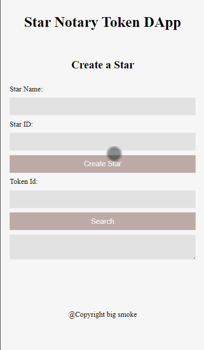

<p align="center">
  <h3 align="center">Star Notary v2.0</h3>

  <p align="center">
    A decentralized application that allows people to create a star on the blockchain and fetch the star name based on it's Id.
    <br>
    </p>
</p>

<br>

## Table of contents

- [About the Website](#about-the-website)
- [Technical](#technical)
- [Licence](#license)
- [Versions](#versions)
- [Contact Information](#contact-information)

### About the website

A decentralized application that allows people to create a star on the blockchain and fetch the star name based on it's Id.

<p align="center">
  
</p>

### Technical

#### Technology Used

This project uses: - HTML - CSS - SCSS - JS - NodeJS - Webpack - Babel - Truffle
- Truffle version `0.5.1` 
- OpenZeppelin library version `2.3.0`
- ERC-721 Token Name `Nyota`
- ERC-721 Token Symbol `NYT`
- Token Address `0x9e4cf570F45425C59f3d0Eb84D9E48E53A6E9E9C`, to view on block explorer, see [here](https://rinkeby.etherscan.io/address/0x9e4cf570F45425C59f3d0Eb84D9E48E53A6E9E9C)


#### Running the project


##### Frontend

The npm packages need to be installed in the **app** directory by running

```console
cd app
```

and then 

```console
npm install
```

Once the installation process has been done, to run the frontend of the project, you can run.

```console
npm run dev
```

##### Backend

A `.secret` file needs to be created at the root of the project with the private key of the account to deploy the contract. This has already been done.


Openzeppelin needs to be installed. This can be done on the **root** of the project by running:

```console
npm install @openzeppelin/contracts@2.3.0
```

Also install `hdwallet` by running

```console
npm install @truffle/hdwallet-provider
```

To run the truffle development enviroment, run:

```console
truffle develop
```

To compile the smart contract, within the truffle development environment, run:

```console
compile
```

To migrate and create a fresh and clean smart contract session, within the truffle development environment, run:

```console
migrate --refresh
```

To run the test cases within the truffle development environment, run:

```console
test
```

#### CONTRIBUTING

I would/ We'd love to have your help in making **{this app (StarNotary v2.0)}** better. The project is still very incomplete, but if there's an issue you'd like to see addressed sooner rather than later, let me(/us) know.

Before you contribute though read the contributing guide here: [Contributing.md](https://github.com/peterokwara/StarNotary2.0/blob/master/CONTRIBUTING.md)

For any concerns, please open an [issue](https://github.com/peterokwara/StarNotary2.0/issues), or JUST, [fork the project and send a pull request](https://github.com/peterokwara/StarNotary2.0/pulls).

<hr>

### License

- see [LICENSE](https://github.com/peterokwara/StarNotary2.0/blob/master/LICENSE) file

### Versions

- Version 1.0 DATE 10/04/2022

### Contact Information

If you have found any bugs, or have any feedback or questions and or want to post a feature request please use the [Issuetracker](https://github.com/peterokwara/StarNotary2.0/issues) to report them.

<hr>

[](#)

<br>

[](https://github.com/peterokwara/StarNotary2.0/blob/master/LICENSE)
